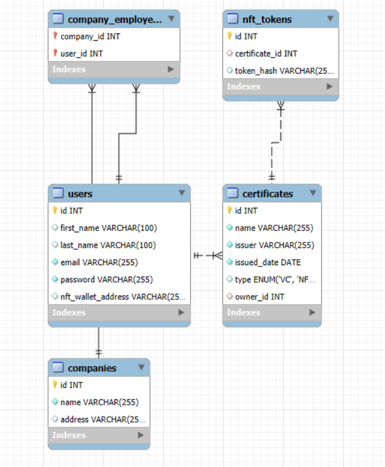

# NFT VC Platform

**[Веб-версия Документации](https://saltyfrappuccino.github.io/nft_vc_platform/главная.html)**


## Описание

NFT VC Platform — это платформа для управления сертификатами и достижениями, поддерживающая Verifiable Credentials (VC) и NFT-токены. Платформа позволяет пользователям регистрироваться, загружать сертификаты, преобразовывать их в NFT, управлять компаниями и сотрудниками, а также выполнять множество других операций.

## Структура репозитория

В корне репозитория находятся три папки:

- **backend** — Бэкенд
- **frontend** — Фронт
- **docs** — Документация в виде веб-сайта. [Ссылка на документацию](https://nft-vc-platform.com/docs)

## Структура БД



## Спецификация API

### 1. Регистрация нового пользователя
URL: `/user/register`

Метод: `POST`

Тело запроса:
```json
{
  "first_name": "string",
  "last_name": "string",
  "email": "string",
  "password": "string"
}
```
Ответы:
- 201: Успешная регистрация
- 400: Ошибка валидации данных
 
### 2. Регистрация компании
URL: `/company/register`

Метод: `POST`

Тело запроса:
```json
{
  "name": "string",
  "address": "string"
}
```
Ответы:
- 201: Успешная регистрация компании
- 400: Ошибка валидации данных

### 3. Загрузка сертификата
URL: `/certificates/upload`

Метод: `POST`

Тело запроса:
```json
{
  "name": "string",
  "issuer": "string",
  "issuedDate": "YYYY-MM-DD",
  "type": "VC/NFT"
}
```
Ответы:
- 201: Сертификат успешно загружен
- 400: Ошибка валидации данных

### 4. Преобразование сертификата в NFT
URL: `/certificates/{id}/convert-to-nft`

Метод: `POST`

Параметры:
- id (path): ID сертификата для конвертации

Ответы:
- 200: Успешная конвертация в NFT
- 404: Сертификат не найден

### 5. Отозвать сертификат
URL: `/certificates/{id}/revoke`
Метод: `POST`

Параметры:
- id (path): ID сертификата для отзыва

Тело запроса:
```json
{
  "reason": "string"
}
```
Ответы:
- 200: Сертификат успешно отозван
- 404: Сертификат не найден

### 6. Передать сертификат
URL: `/certificates/{id}/transfer`
Метод: `POST`

Параметры:
- id (path): ID сертификата для передачи

Тело запроса:
```json
{
  "to_user_id": "string"
}
```
Ответы:
- 200: Сертификат успешно передан
- 404: Сертификат или пользователь не найдены